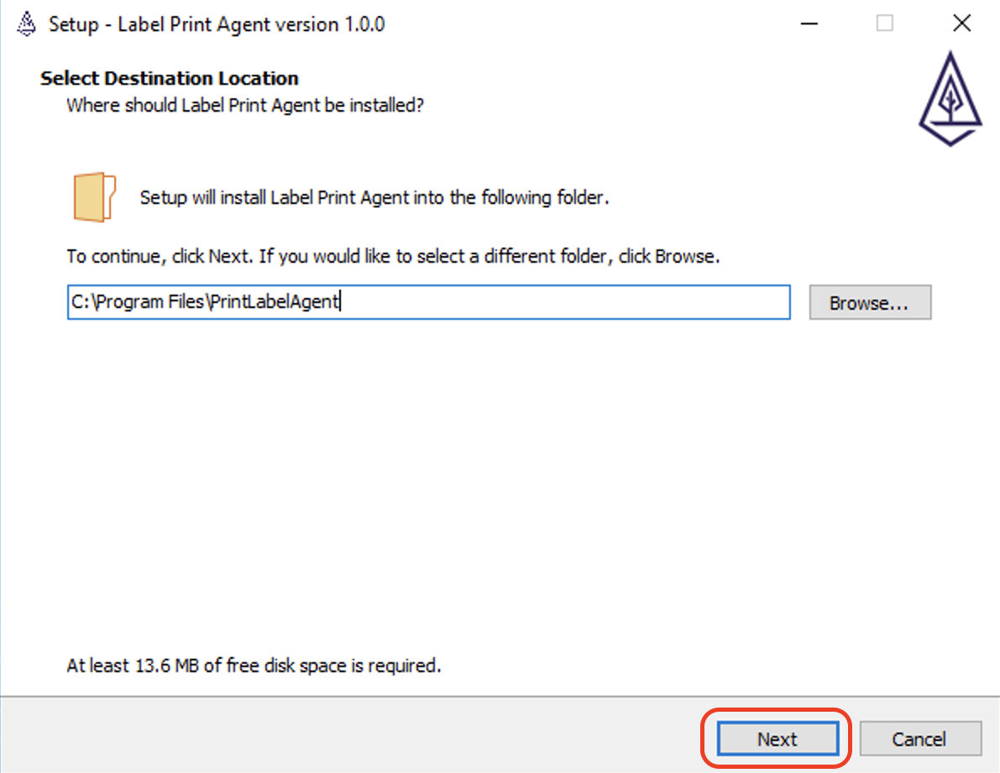
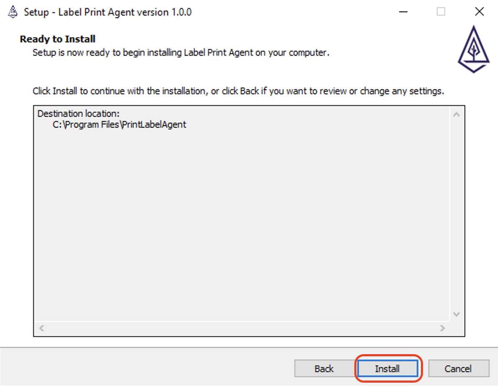
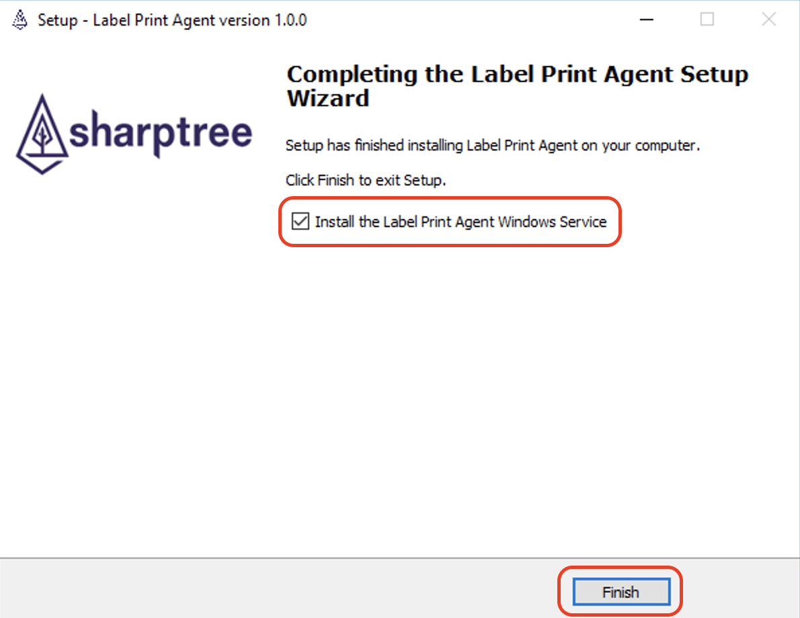

# Introduction 
The Label Print Agent provides handling of label printing events from the Maximo Zebra Printing extension.  The Label Print Agent requires Maximo Zebra Printing extension 1.1.0 or greater.

The Label Print Agent uses Server Side Events (SSE) to listen for print events from printers that have been configured for remote printing within the Maximo Label Configuration application.

# Command Line Arguments
Open a terminal (unix) or command (windows) window and navigate to the installation Label Print Agent installation directory and then run the `label-print-agent-cli.sh` (linux) or `label-print-agent-cli.bat` (windows).

## Options
* -c, --config - The path to the Label Print Agent configuration file, defaults to ./label-print-agent.yaml
* -l, --log - The path to the logback.xml configuration file, defaults to ./logback.xml  If no file is available the default configuration embedded in the label-print-agent.jar is used.
* -h, --help Prints the help for the Label Print Agent command line interface.

## Commands
### monitor
Starts the Label Print Agent, connects to the configured Maximo instance and registers for print events.
### create-apikey
Creates a new Maximo API access key then prints the results to the console.  The result must be manually added to the Label Print Agent configuration file. Once configured, the current password can be removed. 
### revoke-apikey
Revokes the current Maximo API access key.
### encrypt
Creates a new .password.key encryption key if not present, then encrypts the maximo > password configuration option, prefixing the encrypted value with {encrypted}.  The .password.key must be kept safe and should only be accessible by the user that runs the Label Print Agent process. It is a symmetric key that is also used to decrypt the password and may expose the password if not kept secure.  On Windows this file is marked as hidden, on Linux it is hidden by starting with a period (`.`).  
### stop
Stops the monitor process if it is currenty running.
### version
Prints the version information for the Label Print Agent to the console.

# Configuration
The Label Print Agent is configured using the `label-print-agent.yaml` file, which is in YAML format.  The `maximo` configuration block is required and contains the options for establishing a connection to Maximo.  

The optional `printers` configuration block allows filtering of which printers the Label Print Agent will process.  If not provided requests to all printers are processed.

## Maximo
The Maximo connection details are configured in the `maximo` configuration block.  The following properties are available.

| Property      | Description                                                                                                                                           |
|:--------------|:------------------------------------------------------------------------------------------------------------------------------------------------------|
| username      | The Maximo username used to connect to Maximo.                                                                                                        |
| password      | The password for the user used to connecto to Maximo.                                                                                                 |
| host          | The Maximo host name, without the 'http://' or 'https://' protocol prefix or ':80' or '443' suffix.                                                   |
| port          | The port that Maximo is listening on, a value between 0-65535, defaults to 443 if secure is true, 80 if secure is false.                              |
| secure        | Boolean value of `true` or `false`, `true` indcating that SSL should be used, `false` that SSL should not be used.                                    |
| apikey        | The Maximo API key that was generated using the `create-apikey` command.                                                                              |
| allowInsecure | Boolean value of `true` or `false`, if `true` SSL certificate validation is ignored. Defaults to `false`, indicating that certificates are validated. |
| sseEndPoint   | The Servlet end point that implements the print dispatch, defaults to `labeldispatch`.                                                                |    
| context       | The Maximo context, defaults to `maximo`                                                                                                              |   
| authType      | The Maximo authentication type to use, defaults to `maxauth`. Valid values are `maxauth`, `basic`, `form`, `oidc`.                                    |

## Printers
The printers is a list of printers whose print events will be processed by the Label Print Agent. The name of each printer should match that configured in the Maximo Label Configuration application and are provided in a simple YAML list.

## Example Configuration File
```yaml
maximo:
  # The Maximo username
  username: "maximo_user"
  
  # THe Maximo user password
  password: "maximo_password"
  
  # The hostname only, without http or https
  host: "maximo.acme.com"
  
  # The port for Maximo,defaults to 80 for http, 443 for https
  port: 443
  
  # Should SSL (https) be used
  secure: true
  
  # The Maximo ApiKey for access.
  # The label-print-agent-cli.bat has options for creating an ApiKey
  # Details on how to generate a key can be found here:
  # https://www.ibm.com/support/pages/creating-and-using-rest-api-keys-secure-application-server-environment
  apikey = "your_api_key"

  # Flag that indicates if SSL certificate validation will be ignored, defaults to false
  allowInsecure: true / false

  # The Server Side Event end point. This will be appended to the resolved Maximo URL (https://maximo.acme.com/maximo/labeldispatch), defaults to labeldispatch
  sseEndPoint: "labeldispatch"

  # The Maximo application context, for example the ending maximo part of https://maximo.acme.com/maximo, defaults to maximo
  context: "maximo"

  # The type of authentication to use when accessing Maximo, maxauth, form, basic or oidc, defaults to maxauth and will also attempt to auto-negotiate
  authType: "maxauth"

# Optional section that limits the print agent to only handling requests for the listed printers
# If this is not specified all remote printers will be handled by the print agent.
printers:
  - printer1
  - printer2
```

# Service
The Label Print Agent is provided with both Linux and Windows services configurations. The Linux service daemon is provided by the Apache Service Daemon project ([https://commons.apache.org/proper/commons-daemon/jsvc.html](https://commons.apache.org/proper/commons-daemon/jsvc.html)) and the Windows service id provided by the Apache Procrun ([https://commons.apache.org/proper/commons-daemon/procrun.html](https://commons.apache.org/proper/commons-daemon/procrun.html)). 
## Linux
Extract the `label-print-agent-linux-tar.gz` to the installation directory, typically `/opt/label-print-agent-linux`. If extracted to a different directory, edit the `label-print-agent.service` file and replace the `ExecStart` and `ExecStop` paths to match your installation.

### Redhat Enterprise Linux (RHREL)
Copy the label-print-agent.service file to the `/usr/lib/systemd/system/` directory.
```shell
 /bin/cp -f /opt/label-print-agent-linux/label-print-agent.service /usr/lib/systemd/system/
```
Change the file permissions to `644`.
```shell
 chmod 644 /usr/lib/systemd/system/label-print-agent.service 
```
Enable the service.
```shell
systemctl enable label-print-agent
```
### Ubuntu
Copy the label-print-agent.service file to the `/etc/systemd/system` directory.
```shell
 /bin/cp -f /opt/label-print-agent-linux/label-print-agent.service /etc/systemd/system
```
Change the file permissions to `644`.
```shell
 chmod 644 /etc/systemd/system/label-print-agent.service 
```
Enable the service.
```shell
systemctl enable label-print-agent
```
## Windows
For Windows run the `label-print-agent-setup.exe`, then select the installation directory and click the `Next` button.



Review the installation directory and click the `Install` button.



After the installation completes, ensure the `Install Label Print Agent Windows Service` is checked and then click the `Finish` button to complete the installation.



The Label Print Agent Windows Service will automatically be registered, but must be manually started the first time. This allows you to configure the label-print-agent.yaml before running the service.

### Service Configuration GUI
The service uses the Apache Procrun project, (https://commons.apache.org/proper/commons-daemon/procrun.html)[https://commons.apache.org/proper/commons-daemon/procrun.html] to configure and manage the Windows service. You can launch the configuration user interface by executing the `label-print-agentw.exe` program in the Label Print Agent installation directory.